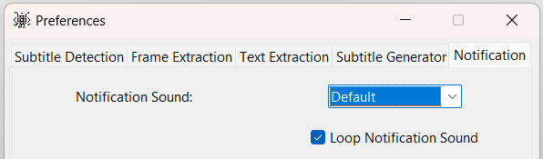

## Preferences

### Subtitle Detection

Split Start: Frame position where subtitle detection will start from. It is relative to the length of the video. 0.0
will start subtitle detection at the beginning of the video.

Split Stop: Frame position where subtitle detection will stop. It is relative to the length of the video. 0.5 will stop
subtitle detection at the middle of the video and 0.95 will stop the detection towards the end of the video.

No of Frames: The number of frames from the start and stop position that will be taken for subtitle detection. Too
little frames and the program will fail to detect the subtitles. Too many and detection takes more time and may capture
more non subtitle text that will incorrectly increase the boundary box.

X Axis Padding: The x-axis padding determines the length of the horizontal line of the boundary box. Subtitle detection
is unable to quickly determine the max x-axis length by looking at all the frames. 1.0 would mean the longest subtitle
spans the entire width of the video. The value is relative to the width of the video.

Y Axis Padding: The y-axis padding prevents the vertical line of the boundary box from being too close to the detected
subtitle text. This value is fixed for all video heights.

Use Default Search Area: The default part of the video frame will be searched to detect subtitles. When unchecked the
entire video frame is searched when detecting subtitles.

### Frame Extraction

Frame Extraction Frequency: The frequency of frame extraction from the video. 1 means every video frame will be
extracted. The timing for the subtitles will be the most accurate and the subtitles might be more accurate. 2 means that
extraction will happen after every 2 frames. The timing will be slightly off, but the entire subtitle extraction process
will be significantly faster because only half of the frames will be used (total frames / 2).

Frame Extraction Batch Size: The number of frames to be extracted by each CPU core.

### Text Extraction

Text Extraction Batch Size: The number of frames to be extracted by each CPU or GPU core/process.

Onnx Intra Threads: The number of threads used by Onnx to parallelize the execution within nodes.

OCR Max Processes: The maximum number of CPU or GPU core/processes to be used for extraction of text from the video.
Too little or too many will increase extraction time.

**Note:** Onnx Intra Threads & OCR CPU Max Processes will require some testing with different values to determine the
optimal values.

OCR Recognition Language: The language of the subtitle in the video to be extracted.

Text Drop Score: The minimum acceptable confidence score for every extracted text. A low score will result in more
inaccurate text in the generated subtitle. A very high score will result in a more accurate text in the generated
subtitle but lots of skipped text.

Use Line Break: A line break will be used when more than one line of text is found in the same frame. This might not
work properly if the OCR detects a lot of space on the same line of text.

### Subtitle Generator

Text Similarity Threshold: The threshold for merging similar texts that appears successively but might be slightly
different because of OCR variability. A lower threshold will result in texts that are different being merged.

Minimum Consecutive Sub Duration: The minimum duration for subtitles that appear consecutively. Consecutively low
duration usually means some background text in the video that appears for a short duration was detected.

Max Consecutive Short Durations: The maximum number of allowed consecutive short subtitle durations. If the detected
consecutive short durations are greater than the value, they will be removed.

Minimum Sub Duration: Any subtitle with a duration less than or equal to this value will be removed.

Use GPU if available: The GPU will for the subtitle extraction if available.

### Notification

Notification Sound: The notification sound that is to be played after subtitle detection or generation is completed.

Loop Notification Sound: The notification sound will be repeated.
